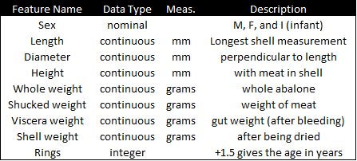

# ENGR 571 - Project 2

# Problem Statement
This project aims to develop a classification algorithm that will predict the number of rings (and by extension the age) of an abalone given following the features and measurements:

Since the number of rings if not a continuous value, this problem can be considered a classification problem. For simplicity, the classes were set as r<4, 5, 6, …, 21, and r>21 (20 classes in total).

Although the results provide no new insight in light of documents that have already been written, it was an excellent exercise to build my first ever classification engine and an exciting introduction to the world data science. A full report summary can be found in the 'docs' page.

# What the Heck is an Abalone?
[Abalone](https://en.wikipedia.org/wiki/Abalone) are marine snails that belong to the family Haliotidae. To determine the age of an individual abalone, it must be cut and stained before the number of rings can be counted through a microscope. Since this is process is often time-consuming and tedious, other approaches involving much easier physical measurements have been proposed to estimate their age.
